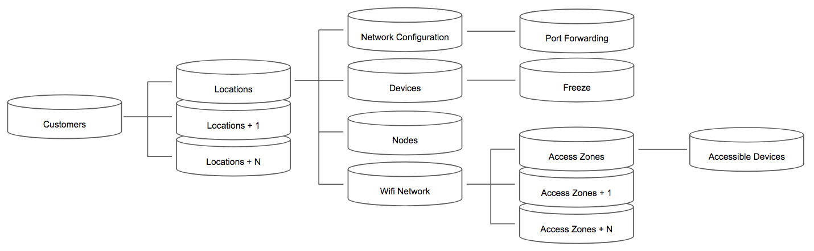
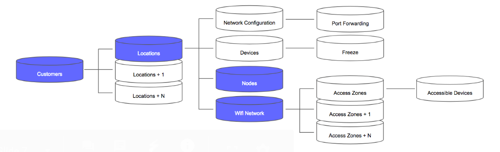

# About Plume Cloud APIs

## Introduction to Plume Cloud APIs

The Plume Cloud includes a robust set of APIs that an ISP can leverage to monitor and provision the service for an end customer. APIs give an ISP the ability to integrate existing tools or build new tools for specific use cases, beyond what has been provided in Frontline. This gives the ability for ISPs to create tools to automate or batch processes or integrate them with other CRM tools.

To effectively use Plume Cloud APIs, it is important to have a solid understanding of some of the terminology, prerequisites, and the Plume Cloud data model.

## User roles
### Group Admins:

 - Are granted read/write permissions to customers within their assigned groups.

### Group Support:

 - Are granted read-only permissions to customers within their assigned groups. They do have permission to operate support tools on customers within their assigned groups:
   - initiate a log pull, steer client devices, and upgrade/downgrade firmware.

### Service and Hardware Prerequisites

Below are the prerequisites for activating the service at a customer’s home.
Prerequisites:

 - The customer has purchased or leased a gateway from the ISP that is capable of running OpenSync software.
 - If whole-home WiFi will be used, then the customer has purchased or leased Plume extender(s) from the ISP.
 - Hardware is onsite or in transit to the customer’s home.
 - The customer has subscribed to the HomePass/WorkPass service from the ISP

### Data Model Overview

The customer API contains all of the necessary functions in order to get a Plume System up and
running at a customer site. WiFi service will be provisioned at the end of the customer onboarding flow. If network devices are powered up and connected to an internet connection,
the configuration will automatically take effect.

Account/user information for a customer lives in the customer object. Additional objects are
associated with a single customer object as shown in the figure below. The additional objects
are used for additional features and functionality.

### Important API Objects

Locations, Nodes, and Wifi Network objects will be used in addition to the Customer object
during the process of onboarding a Customer via the API.

### Customer Object

The Customer object is a fundamental building block within the Plume Cloud. The Customer object is required for both end-customer network services and acts as a role-based access control mechanism for Mobile App based monitoring and provisioning. Locations, Plume Extenders, WiFi networks, devices, and HomePass keys are all associated with a single Customer object.

The first Location object associated with a customer will automatically be created. A customer may have multiple locations, each containing a WiFi network configuration served by multiple Plume Extenders or an ISP Gateway. On the converse, a location or Plume Extenders may be only associated with a single Customer object.

The Customer object contains several elements, including some reserved for Plume Cloud system use. Name and Email are the two required elements to create a Customer object. Plume stock applications, the web-based Frontline, and the Plume mobile app, leverage the Customer API to create customers. Third-party applications can register customer accounts by Plume PartnerId such that a password is not required because the customer will authenticate using their third-party IDP, or they will be prompted to set their password.

### Location Objects

The Location object contains high-level network information for a customer’s location. Upon creation, many fields are already populated with sensible defaults. For the customer onboarding use case, the defaults in a newly created Location need NOT be changed. Creating a Location object for each physical location (i.e., smart home) is always best practice. An individual location allows a customer to have an ISP Gateway at each location and a custom network configuration.

### WiFi Network Object

The WiFi Network object contains essential information for network access at a customer location. Creating a Location does not auto-create a WiFi network thus, creating one via API must occur for an SSID to be broadcasted from the Plume Extenders. 

## List of available APIs

| Link                                           | Description |
|------------------------------------------------| ----------- |
|                                                | Onboarding and Provisioning |
| [Customer Provisioning](CustomerProvisioning.md)                    | 	To start, a unique customer must be registered with the Plume Cloud. Basic information such as their Name, Email, and password must be registered and verified. This can be done via a RESTful API call to the Plume Cloud with an authentication token. |
| [Set the ServiceId for the Customer’s Location](SetServiceId.md)  | 	A customer account may have multiple locations, each location may have a custom serviceID to track multiple service contracts a single customer may have. This is an optional step if the ISP supports multiple locations and would like to mark the location with an ISP known value to distinguish the location (ServiceId is a free text string).|
| [Provisioning Nodes ](ProvisioningNodes.md) |	After creating the Wifi Network, the next step is to claim the Gateway, which may be an ISP Gateway or a Plume pod. A technician may use this API call on a service portal. |
| [Completing Onboarding](CompletingOnboarding.md) | Completing the onboarding will trigger an email to the customer and a timestamp when this process is completed. This step occurs automatically during the final stage of onboarding using the Plume Mobile App. A technician may alternatively complete this action on behalf of the customer using this API from a service portal. |
|                                                | Offboarding and Deprovisioning |
| [Service Cancelation](ServiceCancellation.md) | Process for service cancellation or an RMA. Use cases cover the API calls needed to terminate the service, suspend the account, or unclaim an Extender for RMA purposes. |
| [Unclaim nodes](UnclaimNodes.md)     | To get a node ready to be sent in for replacement via RMA, it must be unclaimed from the customer account and location. This step occurs when the customer removes a node from the Plume Mobile App or support removes it using Frontline. A technician may alternatively complete this action on behalf of the customer using this API from a service portal. |
| [Email Verification](EmailVerification.md)	 | The customer’s email must be verified before the customer can log into the mobile app. The email may be verified by an external system or via the Plume Cloud directly.|
|                                                | Information Retrieval APis |
| [Obtain Customer ID from AccountIDd](ObtainCustomerId.md)            | |
| [Obtain Customer ID and LocationID from Serial Number](ObtainIDFromSerial.md) | |
| [Update Plume Customer AccountID](UpdatePlumeCustomer.md)                | |